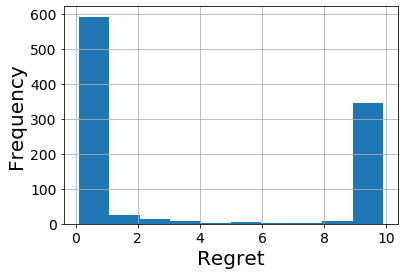

# 4. Stochastic Bandits


This chapter revisits the introduced definitions about regret, learning objectives, environment class in the context of stochastic bandits. The introduced theory is a basis for the next chapters about stochastic bandits.  

A **stochastic bandit**  is a collection of distributions  where  is the set of available actions. The learner and the environment interact sequentially over  rounds. In each round , the learner chooses an action . The environment then samples reward  from the distribution . The learner cannot see the future observations when making current decisions. 

As mentioned in the [Introduction chapter](1_introduction.md), the learner's objective is to choose actions that lead to the largest possible cumulative reward over all  rounds. This task is **not an optimization problem** mainly because the learner does not know the distribution for each arm, in other words the bandit instance  is unknown to the learner. Other reason why a bandit problem is not an optimization problem is that the value of  is not known. This could be however overcome by designing a policy with a fixed horizon and then adapting it for the unknown horizon while proving that the performance loss of this operation is minimal.  
 
## Types of Environment Classes
The book distinguishes between **structured** and **unstructured** environment classes or in other words structured and unstructured bandits.  

### Unstructured Bandits
An environment class  is unstructured if the **set of arms  is finite and there exists sets of distributions  for each  such that**  for all . You can read the above formula such that each arm  has its own function  for distribution of reward. By playing action , the learner thus cannot learn anything about other actions .

Typical unstructured stochastic bandit is a Bernoulli bandit . The implementation of the Bernoulli bandit (Exercise 4.7 from the book) is in the code block below ([github link](https://github.com/azikoss/bandit_summaries/blob/main/bandit/bernoulli.py)). Another classic example is a Gaussian bandit (with unknown variance)  and . These two examples are **parametric** environment classes because the number of degrees of freedom that defines them is finite, otherwise they would be **non-parametric**.


```python
class BernoulliBandit:
    def __init__(self, means):
        """Accepts a list of K >= 2 floats , each lying in [0 ,1]"""
        self._means = means
        self._max_mean = np.max(self._means)
        self._acc_pseudo_regret = 0

    def K(self):
        """Returns the number of arms"""
        return len(self._means)

    def pull(self, a):
        """Accepts a parameter 0 <= a <= K -1 and returns the
        realisation of random variable X with P(X = 1) being
        the mean of the (a + 1) th arm ."""
        reward = np.random.binomial(1, self._means[a])
        self._acc_pseudo_regret += self._max_mean - self._means[a]
        return reward

    def regret(self):
        """Returns the (pseudo) regret incurred so far"""
        return self._acc_pseudo_regret
```

The knowledge (or the assumption that a learner makes) about an environment class influences the performance. With a larger environmental class, it is more difficult to achieve good performance.

### Structured Bandits
**Environment classes that are not unstructured are structured**. In a structured environment class, a learner can obtain information about some actions while never playing them. 

A simple example of an unstructured environment class with  is . In this environment class whose prescription for  is known to the learner (but not the parameter of ), the learner can  learn the mean of both arms by playing just one arm. Another common unstructured bandits are stochastic linear bandits. 

## The Regret
In the [Introduction chapter](1_introduction.md), the regret was informally defined as the deficit suffered by the learner relative to the optimal policy. Let's revisit this definition. Let  be a stochastic bandit and let define the mean reward of arm  as . Then, let  be the largest mean of all the arms. Note that  is formally defined as a function of the bandit instance . When the context is clear,  is omitted from the definition. 

**The regret of policy  on bandit instance  is **, where the expectation is taken with respect to the probability outcomes induced by the interaction of  and .

In stochastic bandit environment
 - the regret is always **non-negative**
 - **exists** a policy that has **zero regret** (optimal policy)
 - achieving **zero regret** is possible if an only if the learner **knows the optimal arm** upfront 
 
 Regarding the last point, a relatively weak objective is to find a policy  with sublinear regret on all . Formally, this objective is to find a policy  for which  for all . In such case, the learner is choosing the optimal action almost all of the time as the horizon goes to infinity. 

An alternative how to define regret is to decompose  into a function of the bandit instance  and a function of the horizon  such that for all , . 

### Decomposing the Regret
This section presents a lemma about regret decomposition that forms a basis for majority of proofs for stochastic bandits.  

Let  be a stochastic bandit and define **suboptimality gap** or **action gap** or **immediate regret** of action   as . Further, let  be the number of times action  was chosen by the learner after the end of the round .  is random even with a deterministic policy that chooses the same action for a given history. This is because   depends on the rewards observed in the previous rounds, which are random, so  and consequently  inherit the randomness.

>The regret decomposition lemma states that for any policy  and stochastic bandit  with finite  and horizon , the regret  of policy  in  satisfies 
.

The lemma decomposes the regret with respect to the losses of each arm. This tells us that to keep the regret small, the learner should try to use an arm with a large suboptimally gap proportionally fewer times.

#### Proof
We will prove that the regret defined by summing over time steps  is equivalent to the definition  from the lemma. The proof goes as follows

1.  
1.  // the summation was moved outside of the expected value and  was moved inside the expected value 
1.  // an indicator function  was added to the formula without changing its value since   at time  
1.  // the expectation was conditioned by 
1.  // the indicator function was taken out of the expectation since action  is given
1.  // the expectation was removed since 
1.  //  was written as  since the indication function zeros out all actions apart from action 
1.  // the definition of the action gap was used
1.  //  was moved outside of the summation over time since it does not depends on time
1.  // the formula for  was used
1.  // the formula for expected value was used 
 

### Alternative Definitions
We defined regret as an expectation. If it is desired to measure the variance of the regret caused by randomness, regret can be defined as a **random regret**  or as a **pseudo regret** . Since   is influenced by the noise , **pseudo-regret appears to be a better** performance measure of a bandit policy.
 
## Follow the Leader 
**Follow-the-leader** (or so called greedy algorithm) is an simple policy that chooses **each action once** and then chooses the action with the **largest observed average reward** so far. The goal of the exercise 4.8 from the book is to implement this algorithm. The implementation goes as follows ([github link](https://github.com/azikoss/bandit_summaries/blob/main/policy/follow_the_leader.py)):   

```python
def FollowTheLeader(bandit, n):
    means = [0] * bandit.K()

    # pulls each arm once
    for t in range(bandit.K()):
        means[t] += bandit.pull(t)
    total_pulls = [1] * n

    # plays the arm with the highest mean
    for t in range(bandit.K(), n):
        # randomly select one of the arms that has the highest mean
        arm = np.random.choice(np.argwhere(means == np.max(means)).flatten())
        means[arm] = ((means[arm] * total_pulls[arm]) + bandit.pull(arm)) / (
            total_pulls[arm] + 1
        )
        total_pulls[arm] += 1
```

Running 1000 simulations ([github link](https://github.com/azikoss/bandit_summaries/blob/main/run/4_follow_the_leader_with_bernoulli_bandit.py)) of the follow-the-leader policy on the Bernoulli bandit with two arms and means  and  with the horizon of  steps and plotting the pseudo regret of each simulation yields Figure 1 below (Exercise 4.11). The figure shows that follow-the-leader policy works very well in many cases as the regret is nearly zero but in other cases it does not as the regret is close to the maximum possible pseudo regret of 10 = (0.6-0.5) * 100. Such a volatility in the performance is typical for this policy. The volatility is caused by the limited exploration that often results in the commitment to play a suboptimal arm.  

<figure class="image" align="center">
  
  <figcaption>Figure 1: Regret of the follow-the-leader policy</figcaption>
</figure> 

# References
This text *my* summary from the 4. Chapter of [Bandit Algorithm](https://tor-lattimore.com/downloads/book/book.pdf) book. The summary contains copy&pasted text from the book as well as some additional text. 
