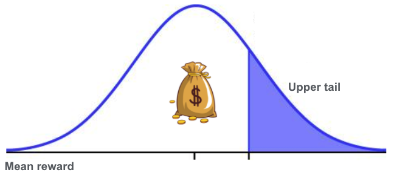

# 5. Concentration of Measure

Let's recall that in the Multi-Armed Bandit setting the pay-offs are initially unknown and we must learn them from data. This chapter introduces theory that explains **how to estimate the upper bound of mean rewards** by using tail probabilities. The introduced concepts are essential to design and understand many bandit algorithms. 
 
# Tail Probabilities
 **Tail probability** is a function of a random variable  and a certain threshold  0"> that **expresses the probability of  being greater or smaller than **.  
 
 We can apply this concept to express how much the sampling reward mean  over/under-estimates the true reward mean . This is formally called a **tail probability of ** and can be expressed as  or . The first expression is called upper tail probability, it presents an upper bound of  and is depicted in the picture above. The second is lower tail probability and it presents a lower bound of . For instance, let  and , given the z-table, the upper tail probability of . 
 
One could think why not to use variance to express the spread of the sample mean , defined as as  [[proof](https://youtu.be/7mYDHbrLEQo)]. The problem is that **variance only quantifies that the squared distance** between  and  and does **not tell much about the distribution of the error** between the sample and the true mean. If we would continue with the above example and say that we would pull an arm  times, then . This expression does not tell anything about the distribution of the distance between  and ; we cannot say that the distance is with certain probability less than  just like the tail probability function does.
 

## The Inequalities of Markov and Chebyshev
In the above example, we calculated the tail probability by using the z-table. In practice, we will **not have such comfort to work with normal distribution only**. Thus, we introduce two most common **inequalities that will help us to bound the tail of *any* random variable **
1. Markov:      
1. Chebyshev: 

Let's illustrate how both inequalities work in practice. We can make an example from any context, since  can be *any* random variable. Let  represent an outcome of a dice. The dice does not have to be fair, but for sake of this exercise let's say it is so . Let's find out what is the probability that  is at least . Using the Markov inequality, . Thus, the probability of rolling 6 (and more) is at most 58.3%. As illustrated in this example, **Markov's inequality is quite loose** since the chance of rolling 6 on a fair dice is only 16.6%. To be exact, we bounded the probability of rolling *at least* six. Since the [proof](https://www.quora.com/What-is-an-intuitive-explanation-of-Markovs-inequality) of the Markov's inequality stems solely from the behavior of  around its mean, it does not matter how many faces would the dice have and the estimate of 58.3% would still hold.  
 
To illustrate the Chebyshev inequality, we have to know the variance of . The variance of a fair dice is 105/36~2.91. Let's bound the same event and express what is the upper tail probability of rolling at least 6. Given that the Chebyshev inequality bounds the distance in between  and its expected value, we need to set  to bound the probability of rolling (at least) 2.5 units from the expected value of 3.5; so essentially rolling 3.5+-2.5 which is equivalent to rolling 1 or 6. Using the Chebyshev inequality, . Thus, the probability of rolling 1 or 6 is at most 46.6%. The bound is again quite loose as the actual probability is 16.6%+16.6% = 33.2%.

 
We can use **Chebyshev inequality and bound the sample reward mean ** (with variance ) as . This inequality is great because it can be used in any context. On the other hand, as we saw above, **the Chebyshev inequality can be quite loose** as it does not rely on any assumption. For that reason, we introduce subgaussian random variables and given their properties present tighter bounds.  

# Subgaussian Random Variables
 **A random variable  is -subgaussian if it holds that  for all **. This says that  is a -subgaussian if the Laplace transform of  is dominated by the Laplace transform of a Gaussian random variable with mean zero and variance  [[ref](http://www.stat.cmu.edu/~arinaldo/36788/subgaussians.pdf)]. The consequence of this is that subgaussian random variables are centered () and their variance is given by the subgaussian parameter . We say that the random variables that are not centered are -subgaussian if the noise  is -subgaussian. Subgaussians have much lighter tails than Guassians (they decay at least as fast as the Gaussians) [[ref](https://statisfaction.wordpress.com/2017/05/02/sub-gaussian-property-for-the-beta-distribution-part-1/)] and they are more uniformly distributed around the mean than the Gaussians [[ref](https://www.researchgate.net/figure/Examples-of-Gaussian-supergaussian-and-subgaussian-distributions-All-distributions_fig3_228661138)]. 

A natural example of a subgaussian random variable is a centered Gaussian. If , then  [[proof](https://ocw.mit.edu/courses/mathematics/18-s997-high-dimensional-statistics-spring-2015/lecture-notes/MIT18_S997S15_Chapter1.pdf)] which is equal to the right-hand side of the definition of subgaussianity above. Thus, center Gaussian is a subgaussian random variable for all . 

Furthermore, 
 * if  has zero mean and  almost surely for , then  is -subgaussian 
 * if  has zero mean and  almost surely, then  is -subgaussian (so the centered distribution of rolling dice  is 5/2-subgaussian) 
 
 
## Bounding Subgaussions
Next we present a **theorem that bounds subgaussian random variables**. If  is -subgaussian, then for any , . The proof  follows the Cremér-Chernoff method and goes as follows
1.  // the whole formula was exponentiated to the power of  with constant  0"> to be tuned later
1.  // Markov's inequality was applied
1.  // the definition of subgaussianity was applied
1. 
1.  // by choosing  to be 

By setting the right hand side of the equation  to , solving this equation for  and making the corresponding substitutions, we get an equivalent form of the above formula: . This form is more convenient because it allows to easily bound the probability of the upper tail of  by . A similar inequality holds for the left tail.

Let's come back to our example and express the probability of rolling at least 6 on a dice. Since we have to center  (by subtracting ) for it to be subgaussian, the equivalent of rolling 6 on a centered distribution of   is 6-3.5=2.5. Given that the centered distribution of the dice rolls is 5/2-subgaussian, the probability of rolling (at least) 2.5 is . The obtained probability should be smaller than the one from Markov's inequality. I cannot explain why this did not happen. Please write to the [discussion](https://github.com/azikoss/bandit_summaries/discussions/categories/5-concentration-of-measure) section if you know.   
 
## Bounding the Sample Reward Mean
**To bound the tail behavior of **, two more lemmas about the subgaussians random variables need to be introduced. Let  be -subgaussian and  and  be independent and  and -subgaussian, respectively, then
1.  is -subgaussian for all  
1.  is -subgaussian 

 
**Presuming that  are independent, -subgaussian random variable, then for any , , where **. The proof goes as follows. By the lemmas in the above paragraph, it holds that  is -subgaussian as each element in the sum is -subgaussian and the sum of  such subgaussians is -subgaussian. Using the theorem on bounding the -subgaussian random variable (while choosing ) finalizes the proof. 
 

The above inequality presents a **stronger bound that the one obtained from Chebyshev's inequality** expect when  is very small.

Similarly as for the general case, the inequality can be rewritten as .

If you have any questions or comments, I would be happy if you write them in the [discussion](https://github.com/azikoss/bandit_summaries/discussions/categories/5-concentration-of-measure) section. 

# References
This text is *my* summary from the 5. Chapter of [Bandit Algorithm](https://tor-lattimore.com/downloads/book/book.pdf) book. The summary contains copy&pasted text from the book as well as some additional text. 
