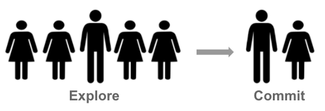
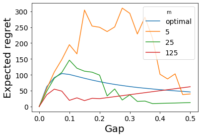

# 6. Explore-Then-Commit Algorithm
<center>

</center>

Explore-then-commit (ETC) is a simple algorithm that **explores each arm a fixed number of times and then commits to playing the arm that performed the best during exploration**. ETC is determined by the number of times  that each arm is explored. Since there are  arms and each arm is explored  times, the algorithm explores  times in total. 

Let  be the average reward received from arm  after round .  is formally defined as 
, where  expresses the number of times arm  has been played after round . The ETC policy goes as follows
1. Input: 
2. In round  choose arm  as  if  otherwise as .

We implemented the ETC algorithm in the similar format as the [implementation](4_stochastic_bandits.html#unstructured-bandits))of the Follow-The-Leader algorithm.

```python
def ExploreThenCommit(bandit, n, m):
    means = np.array([0] * bandit.K())

    # explore
    for t in range(bandit.K() * m):
        arm = t % bandit.K()
        means[arm] += bandit.pull(arm)
    means = means / m
    
    # commit 
    for t in range(bandit.K() * m, n):        
        bandit.pull(
            np.random.choice(np.argwhere(means == np.max(means)).flatten())
        )
``` 

## Regret
Recall that  is the true mean reward of action  and  is the suboptimality gap between the optimal arm and arm .

>When ETC is interacting with any 1-subgaussion bandit and ,  


The proof of the above theorem goes as follows
1. By the regret [decomposition lemma](4_stochastic_bandits.md#decomposing-the-regret), regret of any bandit algorithm can be written as .
1. For ETC,  which reflects that each arm is played  times during the exploration and in the remaining  exploitation rounds each arm is played with a certain probability
1.  // the probability of playing arm  during exploitation can be bounded by the probability that arm  after the last exploration round has the same (or higher) sample reward mean than the arm with the maximum sample reward. The probability on the right hand side is the same or higher than the probability on the left hand side because multiple arms at time  can have the highest sample reward mean.  
1.  // arm 1 was assumed to be the optimal so that 
1.  // suboptimality gap  was added to the right hand side within the probability and , which equals to , to the left hand side.
1.  // the theorem  that bounds subgaussions was used given that  is -subgaussian because (following this [proof](5_concentration_of_measure.md#bounding-the-sample-reward-mean))  and  are both -subgaussians and their sum is -subgaussian  

Substituting row 6. into row 2. and then the result to row 1. finalizes the proof.  

Let's note that the above inequality can be adjusted  when the reward distribution of all arms is not 1-subgaussion. 1-subgaussion is used for the sake of not writing the subgaussion constant  over. The subgaussion parameter  however has to be known by the learner for the above regret bound to hold.


## Exploration length
The bound of the ETC algorithm derived above illustrates the trade-off between exploration and exploitation. If   is large, the algorithm would explore for too long, and the first term would be too large. If  is too small, then the probability that the algorithm commits to exploiting the wrong arm is high, and the second term becomes large. So how to choose ?

Let's illustrate it on an example where  and where the first arm is optimal so  and . Then, the bound of the ETC  simplifies to . The right hand side expression was obtained by removing  from the left hand side expression. For large  the right hand side expression can be minimized by . This would lead to the upper regret bound of  . I did not fully understand the intermediate calculations. They are included in the book and also at this [blog post](https://banditalgs.com/2016/09/14/first-steps-explore-then-commit/#mjx-eqn-eqregret_g). In any case, the above derived regret bound of   relies on the knowledge of the suboptimality gap  and horizon . While the horizon can be known beforehand (and if not the doubling trick can be applied), suboptimally gaps are not. The regret bound of the ETC is  when not relying on the knowledge of the suboptimality gaps. Such a bound is **gap/problem/distribution/instance dependent** since it only depends on the knowledge of the horizon and bandit class, and not on the specific instance within the bandit class.

We let the ETC algorithm play a Bernoulli bandit with  arms and reward means  and  where  is sampled from the interval of . The horizon was . We set the exploration length  optimally by the formula above as well as with several arbitrarily chosen exploration lengths of 5, 25, and 125. The figure below shows the expected reward for the ETC with varying exploration length. Each point in the figure is a mean of 250 simulations. 

<figure class="image" align="center">
  
</figure>  

 

## Future topics
The book includes exercises covering topics that I would like to understand, particularly 
* Ex. 6.5.: choosing the exploration length  only based on the knowledge of the horizon length
* Ex. 6.6.: converting an algorithm whose upper bound is dependent on the knowledge of the horizon into an algorithm that is horizon free

I plan to come back to the above exercises. Please share your solutions if resolve them before me. If you have any questions or comments, I would be happy if you write them in the [discussion](https://github.com/azikoss/bandit_summaries/discussions/categories/6-explore-then-commit) section. 


 
# References
This text is *my* summary from the 6. Chapter of [Bandit Algorithm](https://tor-lattimore.com/downloads/book/book.pdf) book. The summary may contain copy&pasted text from the book. 
