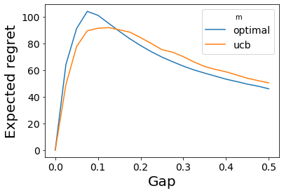

# 7. The Upper Confidence Bound Algorithm
This chapter introduces a simple yet very well functioning algorithm called the upper confidence bound (UCB) algorithm. The algorithm has multiple advantages over the [explore-then-commit (ETC) algorithm](6_explore_then_commit.md). It does not rely on the advance knowledge of the suboptimality gaps and works well when there are more than two arms. The introduced UCB algorithm, just as ETC, depends on the horizon  but the version presented in the next chapter does not. 

## The Optimism Principle
The UCB algorithm follows the principle of **optimism in the face of uncertainty**. This principle states that one should act as if the environment is as nice as **plausibly possible**. To give an example, imagine visiting a new country and making a choice whether to try a local restaurant or a well-known multinational chain. You are uncertain about the food of the local restaurant. It could be equally great as equally bad - you do not know because you have never been there. Following the above principle would mean taking a optimistic opinion about the food in the local restaurant and trying it out. Afterwards, you would update your current knowledge about it and make more informed decision next time. 


Following the optimism principle in the context of bandits means estimating with high probability the mean reward higher than its true value. This over-estimate is called an **Upper Confidence Bound (UCB)**. The intuition why this leas to sublinear regret goes as follows. A suboptimal arm is played only when its upper confidence bound is larger than the upper confidence bound of the optimal arm. But this cannot happen too often because playing a suboptimal arm decrease its upper confidence bound that would eventually fall below the one of the optimal arm. 


Let's formalize the above intuition and define the upper confidence bound. Let  be a sequence of independent 1-subgaussion random variables with mean  and . By what we learnt in [Chapter 5](5_concentration_of_measure.md#bounding-the-sample-reward-mean),
 
 
 <div class="div-table">
    <div class="div-table-row">
    <div class="div-table-col_eq">
           for all 
     </div>
     <div class="div-table-col_expl"><b>(7.1)</b></div>
    </div>
     
 </div> 
    
Since the learner makes a decision at time , defining an upper confidence bound based on the above inequality requires making the terms  and  to be dependent on . At time step , the learner has observed  samples from arm  and received rewards from that arm with an empirical mean of . Then a reasonable candidate for "as large as plausibly possible" for the unknown reward mean of the *i*th arm  is  if  or  otherwise. 

The expression  is called  **confidence width** or **exploration bonus**. 

Now, we can state a version of the UCB algorithm as follows
1. **Input**  and 
1. **for**  and  **do**
1. &emsp; Choose action 
1. &emsp; Observe reward  and update upper confidence bounds
1. **end for**

The implementation of the UCB is provided below. 

```python
def UpperConfidenceBound(bandit, n, delta):
    means = np.array([0] * bandit.K(), dtype=float)

    # pulls each arm once
    for t in range(bandit.K()):
        means[t] += bandit.pull(t)
    total_pulls = np.array([1] * bandit.K(), dtype=float)

    for t in range(bandit.K(), n):
        ucbs = means + calculate_ucb(total_pulls, delta)
        arm = np.random.choice(np.argwhere(ucbs == np.max(ucbs)).flatten())
        means[arm] = ((means[arm] * total_pulls[arm]) + bandit.pull(arm)) / (
            total_pulls[arm] + 1
        )
        total_pulls[arm] += 1


def calculate_ucb(total_pulls, delta):
    return np.sqrt(2 * np.log(1 / delta) / total_pulls)
```

The above algorithm is an **index algorithm**. An index algorithm chooses the arm in each round that maximizes some value, called the **index**. For the UCB algorithm, the index of arm  is . 

 is a called the **confidence level** and it quantifies the degree of certainty.  should be small enough to ensure optimism with high probability but not so large that the suboptimal arms would be explored too frequently. Choosing the confidence level will be done in future chapters. For now, the choice of this parameter is done based on the following considerations. If the confidence interval fails and the index of an optimal arm drops belows its true mean, then it could happen that the algorithm stops playing the optimal arm and suffers linear regret. This suggest choosing  so that playing during a larger horizon would mean less chance to suffer from this failure since the smaller value of  leads to more exploration and thus less chance to estimate the reward mean incorrectly. Things are unfortunately not that simple. The number of samples  in the   index is a random variable, so choosing the confidence level, at least naively, should be done a bit smaller than .

## Regret Analysis
> Theorem 7.1. The regret of the UCB algorithm shown above on any stochastic k-armed 1-subgaussian bandit problem, for any horizon , and  is  0} \frac{16\log(n)}{\Delta_i}">


Let's define some notation before first. Let  be a collection of random variables with the law of  equal to reward distribution . Then, reward at time  is . This is a just technicality. You can think about it such that the rewards of arm  are sampled from  beforehand and stacked one by another. Then, when an arm is pulled at time , the reward placed on the position  is returned. Futher, let  be the empirical mean based on the first  samples. With that, we define .

Without loss of generality we assume that the first arm is optimal so . 

The proof starts by decoupling the randomness from the behavior of the UCB algorithm and defining  as a "good" event by  where  is a constant to be chosen later.  is the event when the reward mean of the optimal arm  is never underestimated by its upper confidence bound while at the same time the upper confidence bound for the reward mean of arm  after  pulls is below the mean reward of the optimal arm. 

The theorem will be proven by bounding  from the regret [decomposition lemma](4_stochastic_bandits.md#decomposing-the-regret)  such that  for each suboptimal arm .The proof is split into two parts.


<p>&nbsp;</p>

**1) If  occur, then  will be played at most  times, so that **

Let's show by contradiction that  when  holds. Suppose that  u_i">. Then arm  was played more than  times over the  rounds, so there must exist a round  where  and . Then

 <div class="div-table">
    <div class="div-table-row">
          <div class="div-table-col_eq"> </div>
        <div class="div-table-col_expl">by definition of the  </div>
    </div>
    <div class="div-table-row">
        <div class="div-table-col_eq"></div>
        <div class="div-table-col_expl">since  </div>
   </div>
    <div class="div-table-row">
        <div class="div-table-col_eq"></div>        
        <div class="div-table-col_expl">by the definition of </div>
   </div>
   <div class="div-table-row">
        <div class="div-table-col_eq"></div>        
        <div class="div-table-col_expl">by the definition of </div>
   </div>
</div>
Since  is smaller than ,
 then , which is a contradiction.This means that if  occurs, .  

<p>&nbsp;</p>

**2) The complement event  occurs with low probability, so that  where  is small.**


 By its definition . Let's decompose the first of these sets  to
  
  

 <div class="div-table">             
    <div class="div-table-row">
    <div class="div-table-col_eq">
            
    </div>
    <div class="div-table-col_expl">using the definition of  and generalizing from time  to any time 
    </div>
    </div>
    <div class="div-table-row">
    <div class="div-table-col_eq">
          
     </div>
    <div class="div-table-col_expl">
    if one condition in the union of sets is true, then minimum of  must be true as well  
     </div>      
    </div>
</div>

Then, we can bound the probability of the occurrence of the first set  by


 <div class="div-table">     
    <div class="div-table-row">
    <div class="div-table-col_eq">
            
    </div>
    <div class="div-table-col_expl">given the decomposition above
    </div>
    </div>
    <div class="div-table-row">
    <div class="div-table-col_eq">
       
    </div>
    <div class="div-table-col_expl">because the subgaussian random variables are indepedent    
    </div>
    </div>    
    <div class="div-table-row">
    <div class="div-table-col_eq">
       
    </div>
    <div class="div-table-col_expl">
    given by (7.1) 
    </div>
    </div>    
</div>

Let's bound the probability of the second set in . Let's assume that
 
 <div class="div-table">
    <div class="div-table-row">
    <div class="div-table-col_eq">
          
    </div>
    <div class="div-table-col_expl"><b>(7.8)</b>
    </div>
   </div>
 </div>

where  is a constant to be chosen later. Then, 


 <div class="div-table">
    <div class="div-table-row">
    <div class="div-table-col_eq">
          
    </div>
    <div class="div-table-col_expl">
    since  
    </div>
   </div>
   
   <div class="div-table-row">
    <div class="div-table-col_eq">
          
    </div>
    <div class="div-table-col_expl">
    by (7.8)
    </div>
   </div>
   
   <div class="div-table-row">
    <div class="div-table-col_eq">        
          
    </div>
    <div class="div-table-col_expl">   
    by <a href="5_concentration_of_measure.html#bounding-the-sample-reward-mean">bounding the tail behavior of the subgaussians</a>  
    </div>
   </div>   
 </div>
 
 
 Putting everything together yields the following bound . Thus, the upper bound of is  is
 
 <div class="div-table">
    <div class="div-table-row">
    <div class="div-table-col_eq">
          
    </div>
    <div class="div-table-col_expl">
    <b>(7.9)</b>
    </div>
   </div>
 </div>
 
 
 Now, we have to choose  such that (7.8) is satisfied. Since we want to pull the suboptimal arm the least times possible, a natural choice is to the smallest integer for which (7.8) holds. By expressing  from (7.8) and ceiling it to the nearest integer, we get . Using this choice of  and the assumption that  leads via (7.9) to 
 
 <div class="div-table">
    <div class="div-table-row">
    <div class="div-table-col_eq">
          
    </div>
    <div class="div-table-col_expl"><b>(7.10)</b>
   </div>      
   </div>   
 </div>
 
 It remains to choose . The term  from (7.10) will polynomially dependent on  unless . Choosing  too close to 1 would blow up the first term of (7.10). Taking the above into consideration,  was chosen somewhat arbitrarily to , which leads to . The proof is completed by substituting the above into the formula with the  decomposition lemma.

The Theorem 7.1 depends on the knowledge of the suboptimality gaps that are not known in practice. This is addressed by the following theorem. 

## Regret bound without suboptimality gaps

> Theorem 7.2. The regret of UCB (defined by the algorithm above) on any stochastic k-armed 1-subgaussion bandit and and when , is bounded by 
>

The proof goes as follows

 <div class="div-table">
   <div class="div-table-row">
        <div class="div-table-col_eq">
                      
        </div>
        <div class="div-table-col_expl">
        by the regret decomposition lemma        
        </div>
   </div>
   
   <div class="div-table-row">
        <div class="div-table-col_eq">
                                
        </div>
        <div class="div-table-col_expl">  
        by splitting the sum into the sums where the suboptimality gaps are lower/higher than some constant  0"> to be tuned later
        </div>
   </div>
   
   <div class="div-table-row">
        <div class="div-table-col_eq">      
                       
        </div>
        <div class="div-table-col_expl">        
        since  and since  as the number of the pulls cannot be larger that the horizon             
        </div>
   </div>
   
   <div class="div-table-row">
        <div class="div-table-col_eq">   
                             
        </div>
        <div class="div-table-col_expl">        
        given that  
        </div>
   </div>
   
   <div class="div-table-row">
        <div class="div-table-col_eq">  
                             
        </div>
        <div class="div-table-col_expl">
        given that  and also that there is at most  such arms
        </div>
   </div>   
    <div class="div-table-row">
        <div class="div-table-col_eq">
                      
        </div>
        <div class="div-table-col_expl">   
        by choosing      
        </div>
   </div>
 </div>

The above bound still includes the suboptimality gaps . This is however unavoidable because any reasonable algorithm must play each arm at least once. In any case, the term  does not grow with the horizon and is thus negligible. 

We let the ETC algorithm with optimal exploration length and the UCB algorithm to play a Bernoulli bandit with  arms and reward means  and  where  is sampled from the interval of . The horizon was . The figure below shows the expected reward. Each point in the figure is a mean of 250 simulations. Although, the ETC uses a knowledge of the suboptimally gaps that are not known in practice, its regret is similar to the UCB algorithm.  

<figure class="image" align="center">
  
</figure>  


If you have any questions or comments, I would be happy if you write them in the [discussion](https://github.com/azikoss/bandit_summaries/discussions/categories/6-explore-then-commit) section. 
 
 
 <div class="div-table">
   <div class="div-table-row">
        <div class="div-table-col_eq">              
        </div>
        <div class="div-table-col_expl">        
        </div>
   </div>            
 </div>
# References
This text is *my* summary from the 7. Chapter of [Bandit Algorithm](https://tor-lattimore.com/downloads/book/book.pdf) book. The summary may contain copy&pasted text from the book. 
