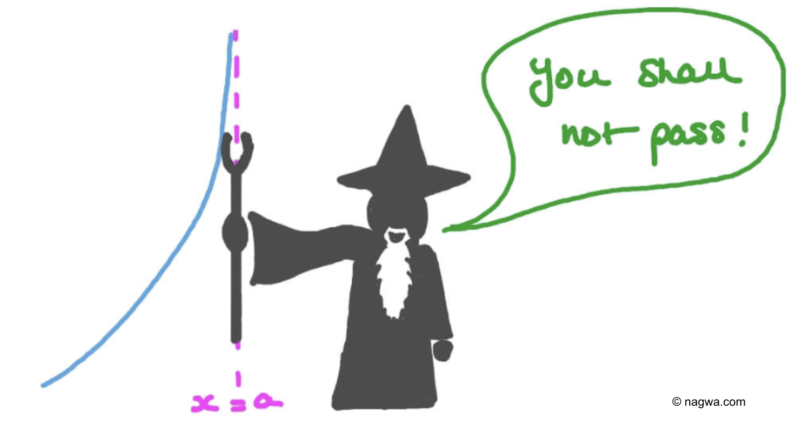

# 8. The Upper Confidence Bound Algorithm: Asymptotic Optimality

**The Upper Confidence Bound (UCB)** algorithm [introduced](7_upper_confidence_bound.md) in the previous chapter is **not anytime** as it requires advanced knowledge of the horizon . This drawback is resolved in this chapter. 

The **asymptotically optimal UCB** introduced in this chapter differs from the previously introduced UCB algorithm just in the **choice of the confidence level** - dictated by the regret analysis. **The algorithm goes as follows**
1. Input:  arms
1. Choose each arm once
1. Choose  where 

## Bounding the frequency of an index
Before the regret analysis, we introduce a lemma that **bounds the number of times the index** (such as UCB) of a suboptimal arm will be **larger** than some **threshold above its mean**. 
 
 > Lemma 8.2. Let  be a sequence of independent 1-subgaussian random variables, ,  0">,   0">, and , , where . Then it holds that .

The proof goes as follows.

    

        

            
        

        

            Since  are
            independent 1-subgaussians with ,
            then in expectation 
            cannot be smaller than  until  is at least . This is because when , then
            
            and all steps before it holds that . If  would be an integer, then .                        
        

    

    

        

            
        

        

            indicator function was changed to probability because of the expected value
        

    

    

        

            
        

        

            by <a href="5_concentration_of_measure.html#bounding-the-sample-reward-mean">bounding
            the
            tail behavior of the subgaussian</a> (with )
        

    

    

        

            
        

        

               was added because the ceiling operator was removed from  and the integral
            spanning from
             to 
            substituted the
            sum
            that goes only till 
        

    

    

        

            
        

        

            using Algebra
        

    

## Regret Analysis
Let's introduce and proof the theorem that bounds the introduced algorithm above.

> Theorem 8.1. For any 1-subgaussian bandit, the regret of the algorithm above satisfies  0} \inf_{\epsilon \in (0, \Delta_i)} \Delta_i (1 %2B \frac{5}{\epsilon^2} %2B \frac{2(\log{f(n)} %2B \sqrt{\pi \log{f(n)}} %2B 1)}{(\Delta_i - \epsilon)^2})">.

The proof is build up on the [regret decomposition lemma](4_stochastic_bandits.md#decomposing-the-regret)  and on bounding  such that  of a suboptimal arm  is decomposed into two terms. The first measures the number of times the index of the optimal arm is less than . The second measures the number of times that suboptimal arm is played () and its index is larger than .

    

        

            
        

        

        &nbsp;     
        

    

    

        

                
        

        

        (8.4)     
        

    

Next we bound the expectation of each of the above sums. The first is bounded as follows.

    

        

             
        

        

        &nbsp;     
        

    

    

        

           
        

        

        union bound over all possible values of          
        

    

    

        

           
        
                    
        

        by <a href="5_concentration_of_measure.html#bounding-the-sample-reward-mean">bounding the tail behavior of the subgaussian</a>                
        

    
  
    

        

           
        
                    
        

        Using algebra within  and leaving some terms out (from )       
        

    
  
      

        

           
        
                    
        

        Algebraic exercise. The function  was chosen so this bound would hold.            
        

    
    

 

The second term in (8.4) we use Lemma 8.2. 

    

        

            
        

        

        &nbsp;     
        

    

     

        

            
        

        

          was replaced by  in the fraction as      
        

    
    
    

        

             
        

        

         The UCB index is calculated for all steps  and not just steps when arm  is pulled    
        

    
        
    

        

             
        

        

         was substituted by      
        

    
    
    

        

            
        

        

        by Lemma 8.2 where  
        

    
    

   
The proof gets completed by substituting the results of two above bounds into (8.4).

# Comparison with the UCB algo from Chapter 7
Part of the Theorem 8.1 that was not mentioned yet is that the **worst-case bound** of the UCB algorithm introduced in this chapter is . This bound has the **same order** as the one of the **UCB algorithm introduced in Chapter 7** (<a href="7_upper_confidence_bound.html#regret-bound-without-suboptimality-gaps">Theorem 7.2</a>). The **leading term** that governs the asymptotic growth of the bound of the algorithm introduced in this chapter is however **smaller**, thus better. This improvement yields from making **the confidence interval slightly smaller** as we did not need to proof that  for all  with high probability but only that  for small . 

If you have any questions or comments, I would be happy if you write them in the [discussion](https://github.com/azikoss/bandit_summaries/discussions/categories/8-ucb-asymptotic-optimality) section. 
 
# References
This text is *my* summary from the 8. Chapter of [Bandit Algorithm](https://tor-lattimore.com/downloads/book/book.pdf) book. The summary may contain copy&pasted text from the book. 
