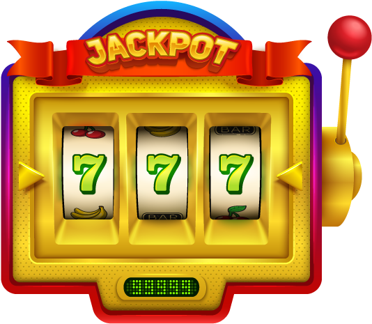

# 1. Introduction
Imagine you are in a casino that has two slot machines. You played four times the first slot machine and got $20 and five time the second slot machine and got $10. The average reward of the first and second machines are $4 and $2 respectively. Say that you have 10 more pulls and you want to maximize your total reward. What is going to be your strategy? Would you exploit the first slot machine in the remaining pulls? Would you further explore the second slot machine that had up till now lowered average reward? Or would you do a combination of both? These questions capture the fundamental dilemma from the Multi-Armed Bandit domain: **to find the right balance in between exploration and exploitation**. 
  
 

Multi-Armed Bandits (or just bandits) provide a model for decision making with uncertainty that we all face daily. Thus, the bandit algorithms have a large-scale utilization in practice. Essentially, bandit algorithms are suitable for any problem that 
- involves choosing action from a set of actions 
- provides reward for a chosen action
- does not require planning for future, in other words, available choices and rewards tomorrow are not affected by their decision today     

Here are a few typical examples that fulfill the above conditions and can be solved with bandits
- **A/B Testing**. Instead of running an A/B test with fixed proportions for each variant (e.g., 50%/50%), one can view each variant as an action and purchase as a reward. Then, bandits can be applied and the proportion for each variant would be set dynamically based its past performance.
- **Advert Placement**. Advert placement can be treated as a bandit problem with actions being all adverts and a reward being when a user click on an advert. 
- **Recommendation Service**. When recommending e.g. movies, actions would be all movies and a reward could be whether a user watched a movie or how the movie was rated. 

# Formal Definition of Bandits

A bandit problem is a sequential game between a **learner** and an **environment**. The game is played over  rounds, where  is a positive natural number called the **horizon**. In each round , the learner first chooses an action  from a given set , and the environment then reveals a reward . An action is an equivalent for "arm", that's why we walk to multi-*armed* bandits.

 In our example with casino the learner is you, the player, the environment are the two slot machines, the horizon was 19 (=4+5+10) pulls, the action set was  where action  means playing slot machine , and the reward  was the money you make in each round. 
  
The learner cannot see the future when choosing an action, so that the current action  should solely depend on the **history** of the past actions and rewards . A **policy** is a mapping from histories to actions. A history is thus an input for policy to determines next actions. A learner follows a policy to interact with an environment. An environment is a mapping from actions to rewards. An action thus determines the next reward.

  In our example with the casino, the history at current round 10 was that you played the first slot machine four times and won $20 and the second slot machine five times and won $10. The policy is your strategy which slot machine to play and when. 

The fundamental challenge in bandit problems is that the environment is unknown to the learner. All the learner knows is that the environment lies in some set  called the **environment class**. 

 Let's continue with our casio example and presume that the learner knows (e.g., read it in the rules) that each slot machine  generates the reward from a Gaussian distribution  that is specific to that machine and independent of the previous action choices and rewards. In such case, the environment class would be Gaussian stationary. Note that the learner does not know the parameters of a distribution but just its type (i.e., that is Gaussian).
  

## Optimization Objective - Regret
The common objective of the learner is to choose actions that lead to the largest possible cumulative reward over all *n* rounds, this can be expressed as . The equivalent objective, which is most typical in the bandit domain, is minimizing **regret**. Regret is defined relatively to a policy or a set of policies. 

The regret of a learner relative to a policy  is the difference between the total expected reward using policy  for  rounds and the total expected reward collected by the learner over  rounds. 

 Let's continue with our casio example and say that the learner wins (in expectation) with his or her strategy $60 over  rounds and that the policy  "play the first slot machine in every round" results (in expectation) in the cumulative rewards over  round in $100. In such case, the regret of the learner relative to  is $100-$60=$40.
 
The regret of a learner relatively to a set of policies  is the maximum regret relative to any policy in the set. This set is called **competitor class**.  The competitor class is often large enough to include the optimal policy for all environments in . In such case, the regret is measured relatively to the optimal policy. 

 Let's continue with our casio example, the natural competitor class is the set of two constant policies  where  means "play slot machine  in every round". Say that  and  results (in expectation) in the cumulative rewards over  round in $100 and $110 respectively, then the regret relative to  over  rounds is max($110, $100) - $60 = $50. This can be formalized as , where  is regret over  rounds
 
One of the core questions in the study of bandits is to understand the growth rate of the regret as  grows. A good learner achieves sublinear regret.

# References
This text *my* summary from the 1. Chapter of [Bandit Algorithm](https://tor-lattimore.com/downloads/book/book.pdf) book. The summary contains copy&pasted text from the book as well as some additional text. 

